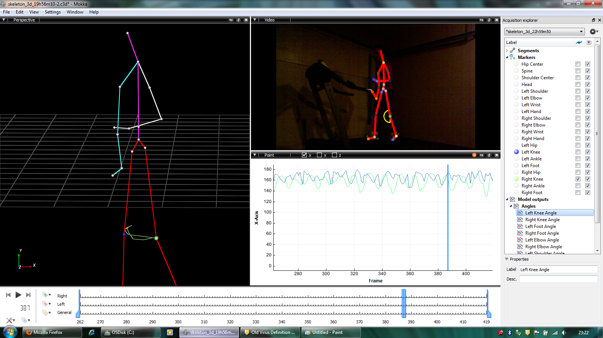

KinectC3D
=========
This application is served as part of a proof of concept for using Kinect in a gait analysis application.

Some modifications were done to the Kinect SDK source to capture the skeleton depth data to C3D file using the [btk library](https://code.google.com/p/b-tk/).
To compile this application link it with BTK 0.1 and the first beta of the Kinect SDK.
Rendering should be redone with Direct3D or OpenGL if one wants to make this work with the 1.7 SDK.

Capturing
---------

With this app you can capture both C3D skeleton tracking data and RGB video ect simultaneously and playback using [Mokka](http://b-tk.googlecode.com/svn/web/mokka/index.html). 
The captured C3D files also contain angular values of the interconnected skeleton joints.

Capture files
-------------
This repository currently contains a couple of test capture files performed on a treadmill from different perspectives. [C3D files](captures/c3d) and their [avi counterparts](captures/avi) can be opened with the [Mokka configuration](captures/mokka_configuration.mvc) file easily.

Publications
------------
A paper was published some time ago using the Kinect to replace different pressure and angular velocity measuring sensors. This might be a [good starting point](docs/KinectGaitEMBC2012.pdf) for further developments.
m

Further Improvements
---------------------
Some new ideas and improvements are the following

* Double the frame rate by interpolating each joint's coordinate data for smooth playback at low rates
* Adding foot 'strike' and 'lift' events in C3D capture files by calibrating the 3D space to take the ground plane into account
* Caclulation of the elbow's velocities e by measuring the angular difference over time
* Calculation of the acceleration of the center of mass of the patient by using the method mentioned in the paper above
* Visualisation of these measurements in an XY scantter plot

Screenshot
----------

